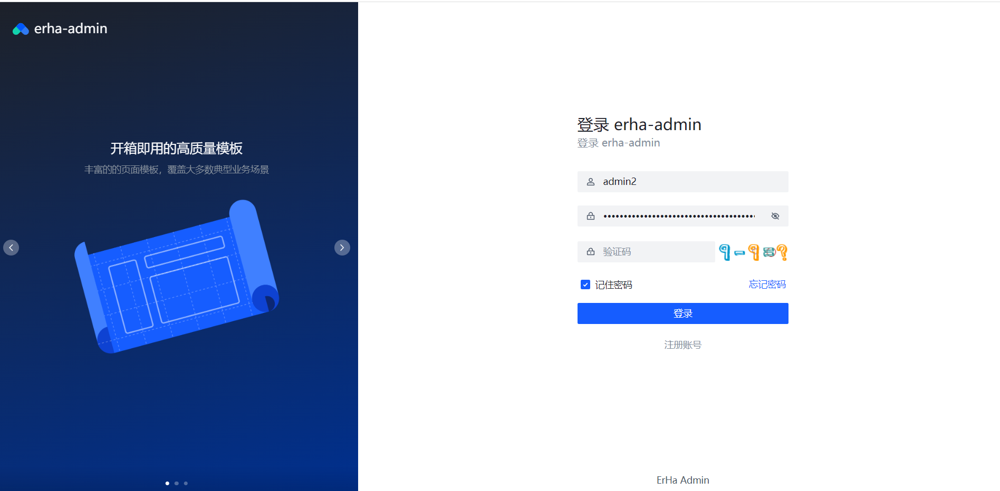
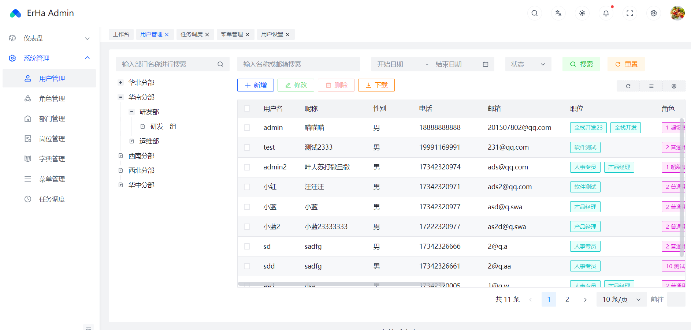
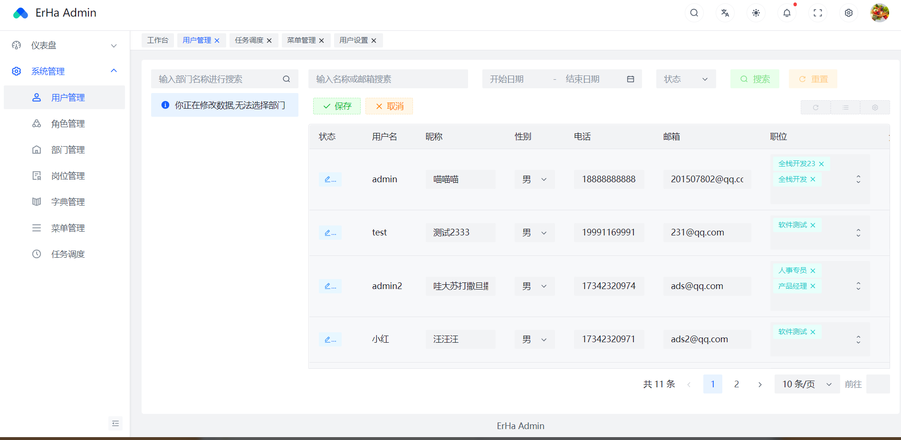
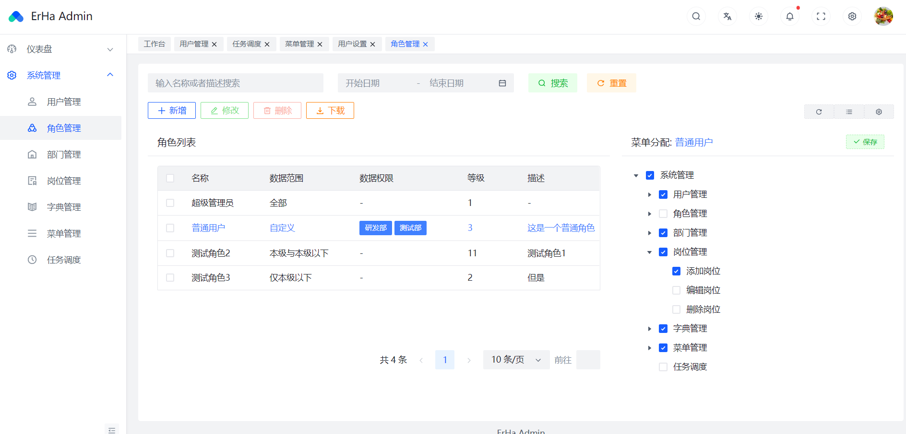
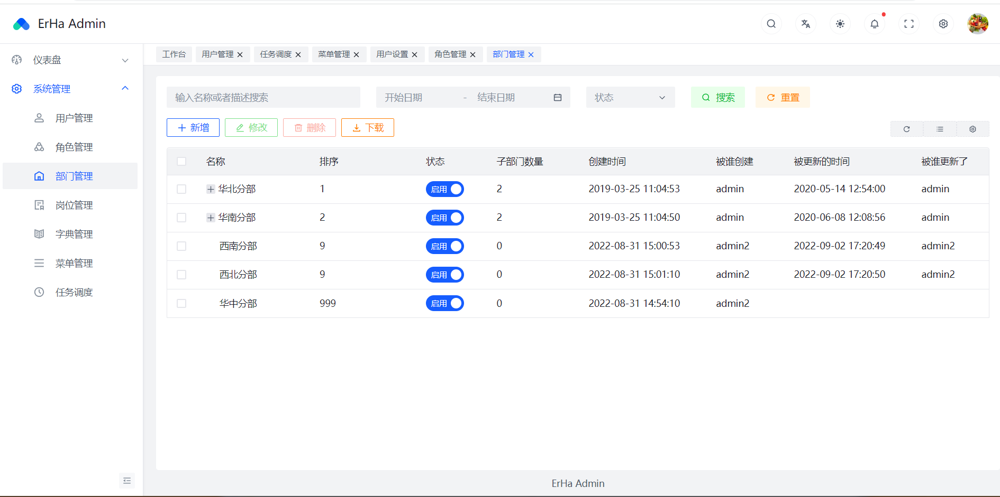
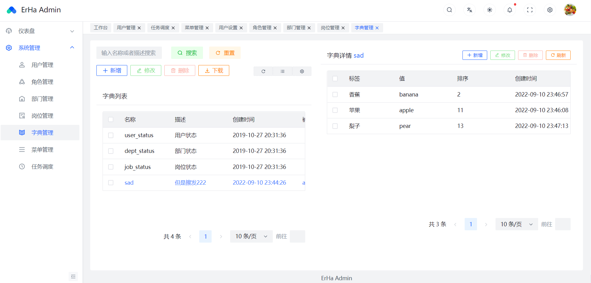
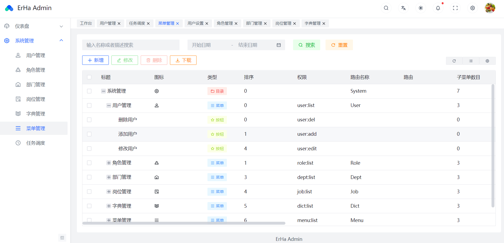
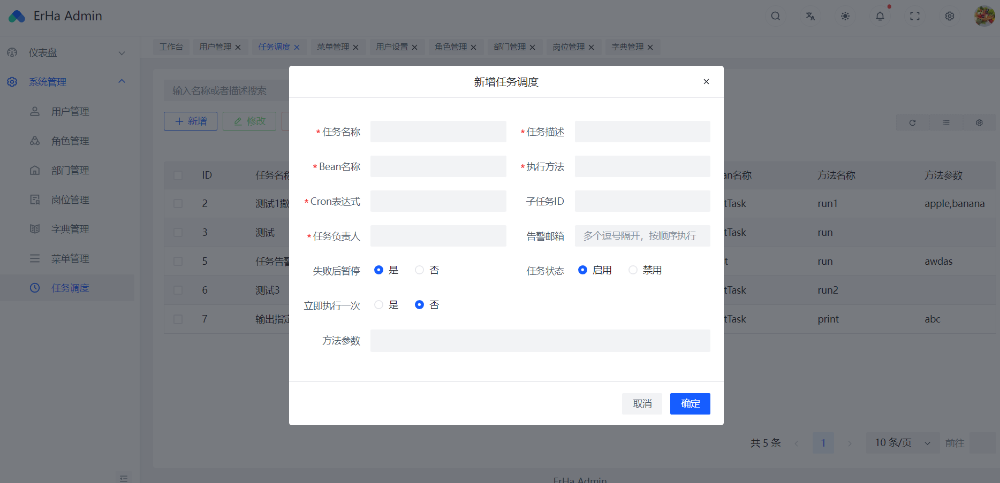
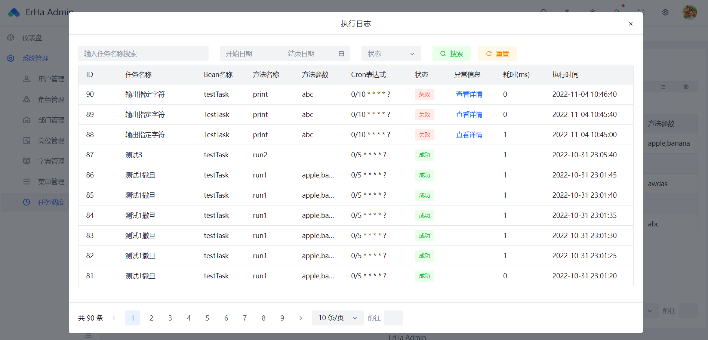

#  EH-ADMIN(后端)

  

    EH-ADMIN，一个基于SpringBoot2 + Vue3 的前后端分离的后台管理系统

<a target="_blank" href="https://github.com/Forever2ha/erha-admin-web">
    	</img>
		</img>
        </img>
        </img>
        </img>
        </img>
        </img>
        </img>
        </img>
</a>

[项目介绍](#项目介绍) | [站点演示](#站点演示) | [项目特点](#项目特点) | [技术架构](#技术选型) | [项目文档](#项目文档)
| [快速开始](#快速开始) | [特别鸣谢](#特别鸣谢)

## 前言
- 本项目借鉴了[eladmin](https://github.com/elunez/eladmin)，对一些方面进行了改进，前端使用了字节的前端UI框架[Arco Design]
  (https://arco.design)进行重构,
  使界面更加友好，简洁。
- 作者本人是第一次学习写项目，对于项目的一些规范可能有所欠缺，如有不当希望大家能多多指点，多多提出问题。

项目进度：
- [x] 系统管理: 用户、角色、菜单、部门、岗位、字典、任务调度管理
- [ ] 系统监控：在线用户、操作日志、异常日志、服务监控、SQL监控
- [ ] 运维管理：服务器、应用管理、部署管理、部署备份、数据库管理
- [ ] 系统工具：代码生成、存储管理、邮件工具、接口文档、支付宝工具
- [ ] 其他功能: ...

QQ交流群：727793103
## 项目介绍

EH-ADMIN是一个基于SpringBoot2与Vue3的前后端分离后台管理系统。Web使用Vue+Arco Design,后端使用SpringBoot+MyBatis-Plus进行开发，使用
SpringSecurity+Jwt做登录验证和权限校验(权限控制采用RBAC思想)。

**源码地址**  

|平台|前端|后端|
|--|--|--|  
|gitee|https://gitee.com/erha_a/erha-admin-web | https://gitee.com/erha_a/erha-admin-main |
|github|https://github.com/Forever2ha/erha-admin-web  |https://github.com/Forever2ha/erha-admin-main |
## 站点演示
**体验地址** : 暂未上线

**开发文档** : http://175.24.198.241/

## 项目特点
- 高效率开发，根据数据库字段一键生成前后端CRUD操作
- 支持数据字典，便于对一些状态进行管理
- 接口限流，防止请求压力过大导致崩溃
- 支持运维管理
## 技术选型
### 前端
|      技术      |    说明    |                                官网                                 |
|:------------:|:--------:|:-----------------------------------------------------------------:|
|    Vue.js    |   前端框架   |                        https://vuejs.org/                         |
|  Vue-router  |   路由框架   |                     https://router.vuejs.org/                     |
|    Pinia     | 全局状态管理框架 |                    https://pinia.vuejs.org/zh/                    |
| jsencrypt.js |  RSA加密   |                http://travistidwell.com/jsencrypt/                |
| Arco Design  |  前端ui框架  |                       https://arco.design/                        |
|    Axios     | 前端HTTP框架 | [ https://github.com/axios/axios](https://github.com/axios/axios) |
|   Echarts    |   图表框架   |                         www.echartsjs.com                         |

### 后端
|       技术       |       说明        |                                           官网                                            |
|:--------------:|:---------------:|:---------------------------------------------------------------------------------------:|
|   SpringBoot   |      MVC框架      |    [ https://spring.io/projects/spring-boot](https://spring.io/projects/spring-boot)    |
| SpringSecurity |     认证和授权框架     |                       https://spring.io/projects/spring-security                        |
|  MyBatis-Plus  |      ORM框架      |                                https://mp.baomidou.com/                                 |
|   Swagger-UI   |     文档生产工具      | [ https://github.com/swagger-api/swagger-ui](https://github.com/swagger-api/swagger-ui) |
|     Redis      |      分布式缓存      |                                    https://redis.io/                                    |
|     Druid      |     数据库连接池      |          [ https://github.com/alibaba/druid](https://github.com/alibaba/druid)          |
|      七牛云       |   七牛云 - 对象储存    |                      https://developer.qiniu.com/sdk#official-sdk                       |
|      JWT       |     JWT登录支持     |                              https://github.com/jwtk/jjwt                               |
|     SLF4J      |      日志框架       |                                  http://www.slf4j.org/                                  |
|     Lombok     |    简化对象封装工具     |    [ https://github.com/rzwitserloot/lombok](https://github.com/rzwitserloot/lombok)    |
|     Nginx      | HTTP和反向代理web服务器 |                                    http://nginx.org/                                    |
|   Mapstruct    |    Java对象拷工具    |                                 https://mapstruct.org/                                  |
|     Hutool     |    Java工具包类库    |                                https://hutool.cn/docs/#/                                |
|     yauaa      | 解析客户端操作系统、浏览器信息 |                                https://yauaa.basjes.nl/                                 |
## 项目文档
...
## 快速开始
### 1. 环境
请提前安装好：mysql5.7 | yarn | redis 5+ | jdk1.8+
### 2. 代码准备
前端:  https://github.com/Forever2ha/erha-admin-web

后端： https://github.com/Forever2ha/erha-admin-main
### 3. 配置
- 在 **doc/sql/** 找到 erha-admin.sql，创建一个数据库，然后导入此sql文件
- 在 **erha-admin-main erha-admin-system/src/main/resources** 找到 application.yml ， 修改你的mysql配置
### 4. 运行
记得提前启动本地redis服务
#### 前端
yarn install

yarn dev
#### 后端
用idea打开直接运行
## 特别鸣谢

- 感谢 [eladmin](https://github.com/elunez/eladmin) 提供的项目结构，数据库等
- 感谢 [Arco Design Pro](https://arco.design/vue/docs/pro/start) 提供的后台开发模板
- 感谢 [JetBrains](https://www.jetbrains.com/) 提供的非商业开源软件开发授权

## 项目捐赠
项目的发展离不开你的支持，请作者喝杯咖啡吧☕

    
    

